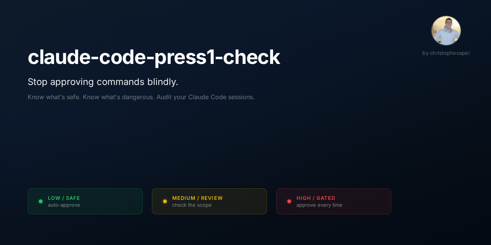

> Find out what you're pressing 1 for -- and whether you should keep pressing it.

A single-file Python script that audits which Bash commands required manual approval ("press 1") in your Claude Code sessions. It reads session transcripts, compares each command against your allow list, classifies risk levels, and suggests rules to add.

## Why this exists

Claude Code asks you to approve Bash commands that aren't in your allow list. After a few sessions, you've pressed 1 dozens of times for `test -f`, `which`, `readlink` -- commands that are completely safe. But you've also approved some `rm` and `git push --force` commands that you probably want to keep gated.

This script tells you which is which.

## Quick start

**Option 1: Download the script**

```bash
curl -O https://raw.githubusercontent.com/christophecapel/claude-code-press1-check/main/audit-permissions.py
python3 audit-permissions.py
```

**Option 2: Clone the repo**

```bash
git clone https://github.com/christophecapel/claude-code-press1-check.git
cd claude-code-press1-check
python3 audit-permissions.py
```

**Option 3: Install as a Claude Code skill**

```bash
git clone https://github.com/christophecapel/claude-code-press1-check.git ~/.claude/skills/press1-check
```

Then use `/press1-check` in any Claude Code session.

## Usage

```bash
# Audit the most recent session (+ its subagents)
python3 audit-permissions.py

# Audit all sessions from the last 24 hours
python3 audit-permissions.py --all-recent

# Audit all sessions since a specific date
python3 audit-permissions.py --since 2026-04-10

# Audit a specific session (prefix match OK)
python3 audit-permissions.py abc123
```

### Sample output

```
============================================================
Session: fe21c486-4c1f-4496-ac9e-6d7f9299a592
============================================================
  [LOW] test -f ~/project/config.yml && echo "EXISTS" || echo "NOT_FOUND"
  [LOW] which node 2>/dev/null
  [HIGH] rm -rf dist/

============================================================
Session: ce445b28-0452-4008-815c-effe4316e914
============================================================
  [LOW] [subagent] readlink ~/.claude/skills/my-skill

============================================================
SUMMARY: 3 low, 0 medium, 1 high (1 from subagents)
============================================================

SUGGESTED ADDITIONS to ~/.claude/settings.json:
(sorted by risk -- add LOW freely, review MEDIUM, skip HIGH)

  [LOW] "Bash(test:*)",  -- SAFE TO ADD -- read-only or local-only
  [LOW] "Bash(which:*)",  -- SAFE TO ADD -- read-only or local-only
  [LOW] "Bash(readlink:*)",  -- SAFE TO ADD -- read-only or local-only
  [HIGH] "Bash(rm:*)",  -- KEEP GATED -- destructive or hard to reverse
```

## How it works

1. **Finds your sessions** -- auto-detects the Claude Code projects directory for your current working directory, falls back to the most recently active project
2. **Scans transcripts** -- reads JSONL session files (including subagent sessions) and extracts every `Bash` tool_use command
3. **Checks the allow list** -- loads `~/.claude/settings.json` and matches each command against your `Bash(...)` permission rules
4. **Classifies risk** -- commands not in the allow list are classified as:
   - **LOW** (green): read-only or local-only, safe to auto-approve
   - **MEDIUM** (yellow): has side effects outside local repo, review before allowing
   - **HIGH** (red): destructive or hard to reverse, keep gated
5. **Suggests rules** -- outputs copy-paste-ready `Bash(...)` rules sorted by risk level

## Risk classification

| Level | Examples | Advice |
|---|---|---|
| HIGH | `rm`, `git reset`, `sudo`, `kill`, `DROP TABLE` | Keep gated. Approve each time. |
| MEDIUM | `git push`, `curl`, `pip install`, `docker`, `open` | Review the pattern. Allow if you trust the scope. |
| LOW | `test`, `which`, `readlink`, `env`, `wc`, `sort` | Add to allow list freely. |

## Requirements

- Python 3.8+
- No external dependencies (stdlib only)
- Claude Code (it reads `~/.claude/settings.json` and session JSONL files)

## About

Built by [Christophe Capel](https://github.com/christophecapel) -- extracted from a personal operating system built with Claude Code. After pressing 1 too many times for `test -f`, I wrote a script to figure out what was actually worth approving.

## License

MIT
